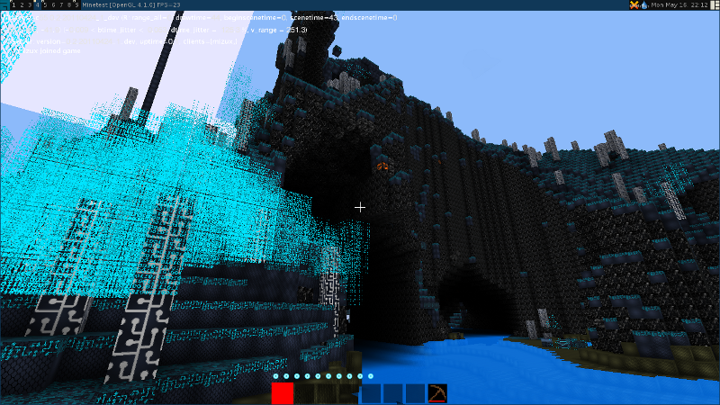

# Introduction
Various texture packs for minetest

**warning**: All this work has been done in ~2011 and was forgotten, so it is not up to date !

# Installation
Simply copy the output directory...

# Texture packs

## Alien Planet
Build dependencies: bash & gimp

Screenshot: NA

## Tron
Build dependencies: bash & inkscape.

Screenshot:  
Stone is not up to date (now it's darker)

Inspired by https://youtu.be/Jolu2gC8Tcs

# License
This work is licensed under the terms of the Apache License 2.0.
See [LICENSE](LICENSE) for more information.
